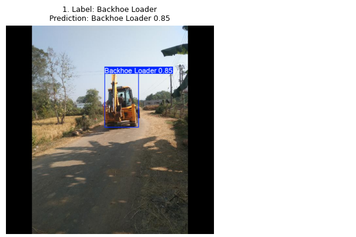
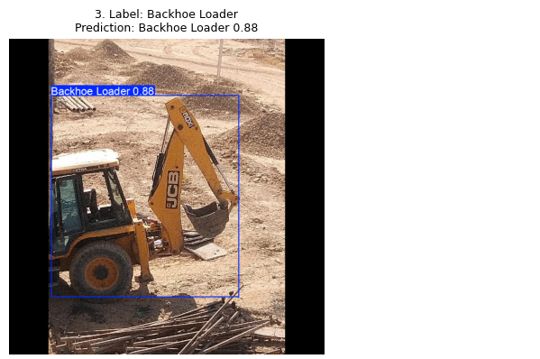
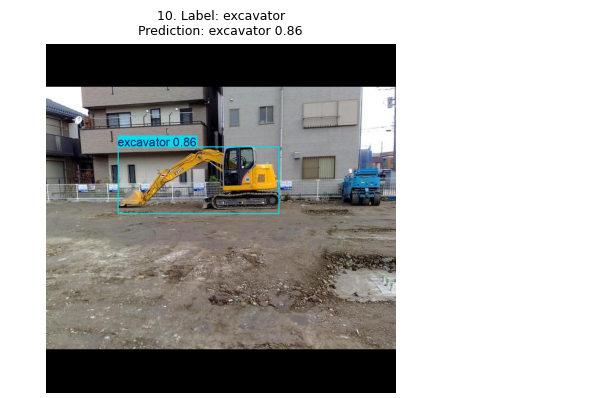

# Backhoe and Excavator Detection for Construction Sites

**A computer vision prototype that locates backhoe loaders and excavators in site photographs.** It draws a bounding box, equipment class, and confidence score for each detection. This is a first step toward reviewing equipment visible on site; machine identity and hire-hour tracking require a separate workflow.

**AECO question:** Can a detector locate these two types of hired equipment in dated construction-site photos so a person can compare visible equipment with hire records? The provisional evaluation goal was test recall of at least 0.70, while also reporting precision and both mAP scores. This goal is for this small experiment, not a claim of operational reliability.

## Does it work?

The model detects both target classes in held-out photos. On the **13-image test split** with 12 labeled target objects:

| Precision | Recall | mAP50 | mAP50–95 |
|---:|---:|---:|---:|
| 0.812 | 0.904 | 0.938 | 0.677 |

### Three successful detections

Each image below is an isolated panel from the saved held-out test prediction grid. Select a thumbnail to see its box and confidence score at full size.

| 1. Rear-view backhoe loader · 0.85 | 2. Backhoe loader at site · 0.88 | 3. Site excavator · 0.86 |
|---|---|---|
|  |  |  |

**[See the annotated examples, training curves, confusion matrix, and failure analysis](results/README.md).** This small test set supports a proof of concept, not a general performance guarantee.

The test recall of 0.904 exceeded the provisional 0.70 goal. The front-loader tractor produced false alarms, while unusual orientation and transport context caused misses at the displayed 0.25 confidence threshold. See the [six-case error analysis](docs/error_analysis.md).

## Try it in Colab

**[Open 02_BHL_EXC_Object_Detection_Inference.ipynb](notebooks/02_BHL_EXC_Object_Detection_Inference.ipynb)** and choose **Runtime → Run all**. The notebook downloads the released model and fixed example photos, then displays predictions. It runs on a CPU without a local installation or credentials.

To reproduce the full 30-epoch training and evaluation, run **[01_BHL_EXC_Object_Detection_Training.ipynb](notebooks/01_BHL_EXC_Object_Detection_Training.ipynb)** in Colab. It verifies the frozen dataset, fine-tunes a pretrained YOLO26n model, evaluates held-out photographs, and examines errors. Select a T4 GPU if Colab makes one available.

If Colab blocks GPU access, use **[03_BHL_EXC_CPU_Verification.ipynb](notebooks/03_BHL_EXC_CPU_Verification.ipynb)**. It checks the same frozen data, trains for five epochs on CPU to verify the pipeline, then downloads the released **30-epoch** `best.pt` for final test evaluation and predictions. Its five-epoch checkpoint is not substituted for the reported model.

### Reproducibility checklist

1. Open the notebook appropriate to your runtime from its Colab badge; choose **Runtime → Run all**. No local installation, Roboflow account, API key, or Colab secret is needed.
2. The notebook downloads [Roboflow version 3's frozen export](https://github.com/Asiya0555/Backhoe-Excavator-Site-Detection/releases/download/v1.0.0/backhoe-excavator-v3-yolov11.zip) and verifies SHA256 `8e3645e885a7f4b3ec90c25cdf39b680a474448659397f123ac13a7d28ccab8a`. The [Roboflow version page](https://universe.roboflow.com/asiya-begum-aurak-ac-ae/excavator-backhoe-detection-in-construction-site_ab/dataset/3) documents the annotation source.
3. Full training uses **YOLO26n** with `ultralytics==8.4.163`, 30 epochs, batch size 16, 640 × 640 images, and seed 42. The CPU verification run uses five epochs and batch size 8, then separately loads the released full-run checkpoint. The exported dataset uses the YOLOv11 annotation format; that format name does not change the trained model.
4. Expected outputs are split and class checks, a training `results.png`, the validation-selected `best.pt`, test precision/recall/mAP50/mAP50–95, a confusion matrix, and prediction grids. The separate inference notebook loads the released checkpoint and displays three fixed test photos.

**Run proof (27 September 2026):** The inference notebook completed a fresh CPU Colab **Run all** without credentials. The original training run completed 30 epochs on a Tesla T4 in about 2 minutes of training time. When Colab later restricted GPU access, the [CPU verification notebook](notebooks/03_BHL_EXC_CPU_Verification.ipynb) completed a fresh **Run all** on an Intel Xeon CPU at 2.20 GHz with `ultralytics==8.4.163`: five verification epochs took **7.2 minutes**, and the notebook took **7.4 minutes after installation** (completed 27 September 2026 at 17:39 UTC). It then loaded the separately released 30-epoch `best.pt`, evaluated all 13 held-out test images, and reproduced precision **0.812**, recall **0.904**, mAP50 **0.938**, and mAP50–95 **0.677**. The five-epoch validation scores are only a pipeline check and are not the reported model results.

As a planning estimate, allow roughly **10–20 minutes** for the CPU verification notebook including installation and downloads; Colab and network speeds vary. The original T4 training time above is the training step, not a guaranteed whole-notebook runtime.

## Method and data

Roboflow version 3 contains **105 training, 13 validation, and 13 test images**, including 11 negative images across those splits. Two detection classes are defined: `0 = Backhoe Loader` and `1 = excavator`. Background is an evaluation category, not a third dataset class. Related views were kept together where identified.

This is approximately an **80/20 train/evaluation split**: 105 of 131 images (80.2%) are for training; the remaining 26 (19.8%) are divided into 13 validation and 13 held-out test images. The two classes use a box around each identifiable whole machine. A backhoe loader has a front bucket and rear digging arm; an excavator has a boom and upper body without that front-loader/rear-backhoe arrangement. Ambiguous partial views are reviewed rather than guessed from a bucket alone, and photos with neither target remain unboxed negatives. See the [full class and labeling rules](docs/class_definitions.md).

The [class and labeling rules](docs/class_definitions.md) explain how to distinguish the machines, handle partial views, and keep genuine negative photos. The [annotation workflow](docs/annotation_workflow.md) records the SAM-assisted review and its limits.

The export applied auto-orientation, 640 × 640 resizing with black-edge padding, and filtering of images tagged `Exclude from training`; Roboflow augmentation was off. A pretrained YOLO26n was fine-tuned for 30 epochs, and the validation-selected `best.pt` checkpoint was evaluated on the test split.

- [Roboflow project, version 3](https://universe.roboflow.com/asiya-begum-aurak-ac-ae/excavator-backhoe-detection-in-construction-site_ab/dataset/3)
- [Frozen YOLOv11-format dataset ZIP](https://github.com/Asiya0555/Backhoe-Excavator-Site-Detection/releases/download/v1.0.0/backhoe-excavator-v3-yolov11.zip), SHA256 `8e3645e885a7f4b3ec90c25cdf39b680a474448659397f123ac13a7d28ccab8a`
- [Trained model weights, best.pt](https://github.com/Asiya0555/Backhoe-Excavator-Site-Detection/releases/download/v1.0.0/best.pt)

The ZIP and weights are release assets rather than repository files. Both notebooks use fixed public URLs, so a reader can rerun the example without a Roboflow API key.

## Project files

The short PDF pack presents the project in two formats: [seven-slide presentation](reports/BHL_EXC_Detection_Slides_FINAL.pdf) and [two-page mini report](reports/BHL_EXC_Detection_Mini_Report_FINAL.pdf). Editable [PowerPoint](reports/BHL_EXC_Detection_Slides_EDITABLE.pptx) and [Word](reports/BHL_EXC_Detection_Mini_Report_EDITABLE.docx) copies are also available. The slides show selected success and failure images; the [error analysis](docs/error_analysis.md) records all three false-positive detections, three false-negative examples, and three linked data improvements.

| Path | Purpose |
|---|---|
| [`notebooks/01_BHL_EXC_Object_Detection_Training.ipynb`](notebooks/01_BHL_EXC_Object_Detection_Training.ipynb) | Dataset checks, training, evaluation, error analysis |
| [`notebooks/02_BHL_EXC_Object_Detection_Inference.ipynb`](notebooks/02_BHL_EXC_Object_Detection_Inference.ipynb) | Quick prediction demonstration with the released model |
| [`notebooks/03_BHL_EXC_CPU_Verification.ipynb`](notebooks/03_BHL_EXC_CPU_Verification.ipynb) | Five-epoch CPU check plus released checkpoint evaluation |
| [`results/`](results/README.md) | Curves, confusion matrix, success and failure examples |
| [`docs/governance_checklist.md`](docs/governance_checklist.md) | Provenance, privacy, risk and human review |
| [`docs/class_definitions.md`](docs/class_definitions.md) | Classes, whole-object boxes, and negatives |
| [`docs/problem.md`](docs/problem.md) | AECO problem, evaluation goal, and scope |
| [`docs/annotation_workflow.md`](docs/annotation_workflow.md) | Dataset curation, SAM exploration, and export choices |
| [`docs/error_analysis.md`](docs/error_analysis.md) | Three false detections, three misses, and data improvements |
| [`reports/`](reports/) | Presentation and mini report PDFs |

## Limitations and responsible use

The model mistook a front-loader tractor for target equipment, produced a duplicate excavator box, and missed machines in unusual orientations or contexts. One missed sideways backhoe was detected at confidence 0.81 when rotated upright; this is a single-image diagnostic, not proof of broad rotation robustness.

**This model is an assistive tool for preliminary screening only. It produces false negatives. It must not be used as the sole verifier for life-safety decisions.** A person must check images and predictions before using them for project decisions.

## License and image credit

Original code and prose are under the [MIT License](LICENSE). The images in the dataset Release come from two Roboflow Universe projects that each list [CC BY 4.0](https://creativecommons.org/licenses/by/4.0/); their image rights remain with their respective licensors:

- [Excavator Construction Vehicle](https://universe.roboflow.com/datacluster-labs-agryi/excavator-construction-vehicle) by **DataCluster Labs** (source of the backhoe-loader examples).
- [Excavators](https://universe.roboflow.com/mohamed-sabek-6zmr6/excavators-cwlh0) by **Mohamed Sabek** (source of the additional excavator examples).

This project selected a subset, reviewed and changed class labels and annotations, excluded unsuitable photos, assigned train/validation/test splits, and exported resized 640 × 640 images. The [governance checklist](docs/governance_checklist.md) records provenance and human review. Neither source is represented as endorsing this project.
