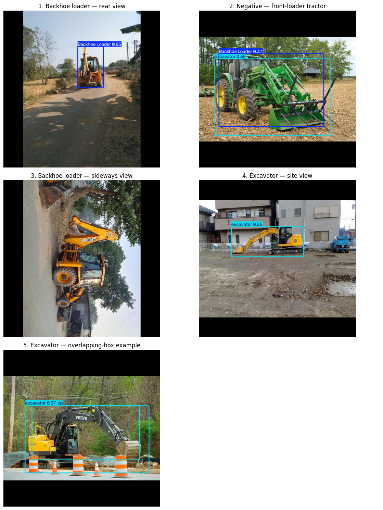

# Backhoe and Excavator Detection for Construction Sites

**A computer vision prototype that locates backhoe loaders and excavators in site photographs.** It draws a bounding box, equipment class, and confidence score for each detection. This is a first step toward reviewing equipment visible on site; machine identity and hire-hour tracking require a separate workflow.

## Does it work?

The model detects both target classes in held-out photos. On the **13-image test split** with 12 labeled target objects:

|Precision|Recall|mAP50|mAP50–95|
|-:|-:|-:|-:|
|0.812|0.904|0.938|0.677|

[**See the annotated examples, training curves, confusion matrix, and failure analysis**](results/README.md)**.** This small test set supports a proof of concept, not a general performance guarantee.

## To Try it in Colab

[**Open 02\_BHL\_EXC\_Object\_Detection\_Inference.ipynb**](notebooks/02_BHL_EXC_Object_Detection_Inference.ipynb) and choose **Runtime → Run all**. The notebook downloads the released model and fixed example photos, then displays predictions. It runs on a CPU without a local installation or credentials.

To reproduce training and evaluation, run [**01\_BHL\_EXC\_Object\_Detection\_Training.ipynb**](notebooks/01_BHL_EXC_Object_Detection_Training.ipynb) in Colab. It verifies the frozen dataset, fine-tunes a pretrained YOLO26n model, evaluates held-out photographs, and examines errors. A GPU speeds up training, but the notebook also supports a CPU runtime.

## Method and data

Roboflow version 3 contains **105 training, 13 validation, and 13 test images**, including 11 negative images across those splits. Two detection classes are defined: `0 = Backhoe Loader` and `1 = excavator`. Background is an evaluation category, not a third dataset class. Related views were kept together where identified.

The export applied auto-orientation, 640 × 640 resizing with black-edge padding, and filtering of images tagged `Exclude from training`; Roboflow augmentation was off. A pretrained YOLO26n was fine-tuned for 30 epochs, and the validation-selected `best.pt` checkpoint was evaluated on the test split.

* [Roboflow project, version 3](https://universe.roboflow.com/asiya-begum-aurak-ac-ae/excavator-backhoe-detection-in-construction-site_ab/dataset/3)
* [Frozen YOLOv11-format dataset ZIP](https://github.com/Asiya0555/Backhoe-Excavator-Site-Detection/releases/download/v1.0.0/backhoe-excavator-v3-yolov11.zip), SHA256 `8e3645e885a7f4b3ec90c25cdf39b680a474448659397f123ac13a7d28ccab8a`
* [Trained model weights, best.pt](https://github.com/Asiya0555/Backhoe-Excavator-Site-Detection/releases/download/v1.0.0/best.pt)

The ZIP and weights are release assets rather than repository files. Both notebooks use fixed public URLs, so a reader can rerun the example without a Roboflow API key.

## Project files

|Path|Purpose|
|-|-|
|[`notebooks/01\_BHL\_EXC\_Object\_Detection\_Training.ipynb`](notebooks/01_BHL_EXC_Object_Detection_Training.ipynb)|Dataset checks, training, evaluation, error analysis|
|[`notebooks/02\_BHL\_EXC\_Object\_Detection\_Inference.ipynb`](notebooks/02_BHL_EXC_Object_Detection_Inference.ipynb)|Quick prediction demonstration with the released model|
|[`results/`](results/README.md)|Curves, confusion matrix, success and failure examples|
|[`docs/governance\_checklist.md`](docs/governance_checklist.md)|Provenance, privacy, risk and human review|

## Limitations and responsible use

The model mistook a front-loader tractor for target equipment, produced a duplicate excavator box, and missed machines in unusual orientations or contexts. One missed sideways backhoe was detected at confidence 0.81 when rotated upright; this is a single-image diagnostic, not proof of broad rotation robustness.

**This model is an assistive tool for preliminary screening only. It produces false negatives. It must not be used as the sole verifier for life-safety decisions.** A person must check images and predictions before using them for project decisions.

## License and image credit

Original code and prose are under the [MIT License](LICENSE). The images in the dataset Release come from two Roboflow Universe projects that each list [CC BY 4.0](https://creativecommons.org/licenses/by/4.0/); their image rights remain with their respective licensors:

* [Excavator Construction Vehicle](https://universe.roboflow.com/datacluster-labs-agryi/excavator-construction-vehicle) by **DataCluster Labs** (source of the backhoe-loader examples).
* [Excavators](https://universe.roboflow.com/mohamed-sabek-6zmr6/excavators-cwlh0) by **Mohamed Sabek** (source of the additional excavator examples).

This project selected a subset, reviewed and changed class labels and annotations, excluded unsuitable photos, assigned train/validation/test splits, and exported resized 640 × 640 images. The [governance checklist](docs/governance_checklist.md) records provenance and human review. Neither source is represented as endorsing this project.

