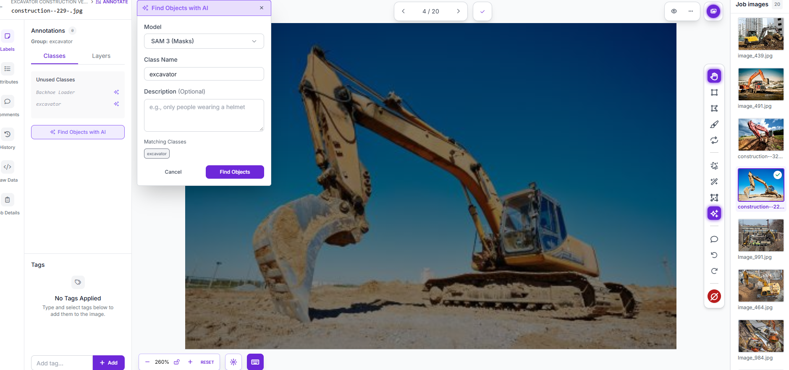
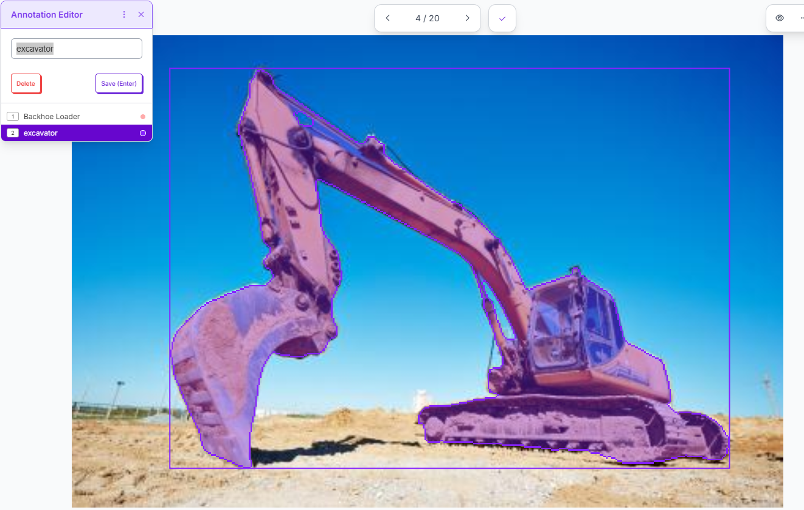
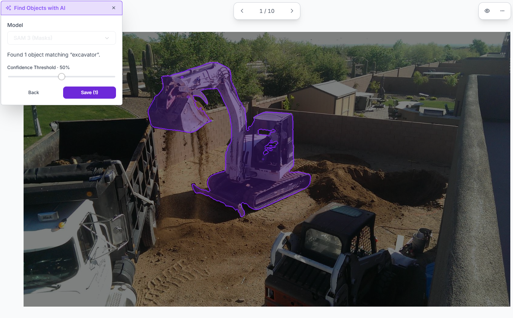

# Dataset curation and SAM exploration

The initial Roboflow source was named for excavators, but visual review found many backhoe loaders. Those selected images were relabeled to `Backhoe Loader`; additional excavator photos came from the [Mohamed Sabek source project](https://universe.roboflow.com/mohamed-sabek-6zmr6/excavators-cwlh0). Ambiguous or unsuitable images were reviewed, and five source images tagged `Exclude from training` were omitted from version 3. Negative photos remained unboxed. Related views were grouped into a common split where identified.

## SAM-assisted annotation review

SAM was explored on approximately 13 images to propose object polygons. When the whole machine was clearly visible, it often outlined the equipment usefully and reduced manual tracing. For machines partly hidden behind another vehicle or appearing small and distant, the proposed polygon could be sparse or incomplete. These proposals required visual review and correction; SAM output alone was not treated as a verified class label or a complete machine boundary. The YOLO detection training used object boxes from the exported annotations.

### Screenshots of the SAM-assisted workflow

These Roboflow screenshots document the annotation tool during review. The purple regions are **proposed masks**, not evidence that every proposal was accepted without correction. Select an image to inspect it at full size.

| Set the class and run SAM 3 | Review a clear excavator proposal | Review a proposal in a crowded scene |
|---|---|---|
|  |  |  |

The clear example shows a useful candidate outline and enclosing box. The crowded example shows why a reviewer still checks the proposed boundary against nearby vehicles. The screenshots show the proposal/review stage, not final YOLO training predictions or a measured SAM accuracy result.

## Frozen export

Roboflow version 3 contains 105 training, 13 validation, and 13 test images (131 total), with 11 negative images among the splits. Preprocessing applied auto-orientation and 640 × 640 resizing with black padding; Roboflow augmentation was off. The version was downloaded in YOLOv11 annotation format. The [frozen ZIP and its checksum](../README.md#method-and-data) identify the exact data used for the reported YOLO26n training run.
