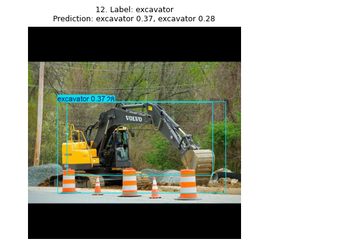
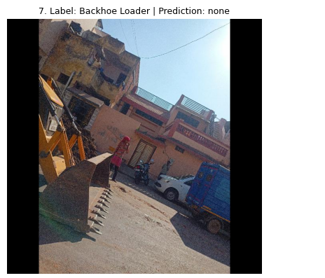

# Error analysis and next data steps

The reviewed prediction grids use a **0.25 display confidence threshold**. The 13-image test set contains 12 labeled target objects; the ten-photo validation grid is a fixed sample. The model can produce different scores if retrained. These examples describe the saved run and are not a second test-set metric.

The evidence thumbnails below are exact crops from the saved prediction grids. Select a thumbnail to open just that photo and its label/prediction heading.

## Three false-positive detections

| Case | Evidence | Observation and plausible cause |
|---|---|---|
| FP1 |  | A negative front-loader tractor received a `Backhoe Loader` box at 0.37. Its tractor body and front bucket resemble part of the target silhouette, although a rear backhoe is not established. |
| FP2 |  | The **same** negative tractor also received an `excavator` box at 0.35. Its raised equipment and overlapping machinery shapes may have confused the class boundary. This is a second false box, not a second photograph. |
| FP3 |  | One labeled excavator received two overlapping excavator boxes (0.37 and 0.28). One is an extra prediction for the same visible object, possibly due to weak localization or duplicate suppression at this threshold. |

These are **three false detections across two test photographs**. We do not claim three independent false-positive images.

## Three false-negative examples

| Case | Evidence | Observation and plausible cause |
|---|---|---|
| FN1 |  | A labeled backhoe loader rotated sideways was missed at 0.25. Rotating this same photo upright led to a `Backhoe Loader` prediction at 0.81 in the [orientation check](../results/orientation_comparison.png), supporting orientation as a factor for **this image**. |
| FN2 |  | An excavator carried on a transport vehicle was missed. Its context and partly obscured outline differ from typical working excavators. |
| FN3 |  | A partly visible backhoe loader was missed. Its crop/occlusion leaves fewer class-defining features visible. This case is from **validation**, not the held-out test set. |

These are qualitative examples at the stated threshold; the Ultralytics summary metrics and confusion matrix use their own matching and confidence processing and need not reproduce this list box for box.

## Prioritized data improvements

1. **Add hard negatives:** Collect and verify more front-loader tractors, wheel loaders, and other similar non-target machines in comparable site views. Keep them unboxed when neither target is present, then check whether false alarms decrease.
2. **Broaden difficult target views:** Add independently sourced and correctly boxed backhoe loaders and excavators that are rotated, partly cropped, distant, obscured, on slopes, and on transport vehicles. Group views of the same machine in one split, then measure recall on an independent set.
3. **Improve annotation consistency and diversity:** Review full-machine box extents and ambiguous partial images; add distinct sites, lighting conditions, and machine instances instead of many near-duplicate frames. Reassess duplicate boxes and the confidence/suppression settings using validation images before a new final test.

Because the test set is small, these cases guide the next dataset version rather than establish production performance.
