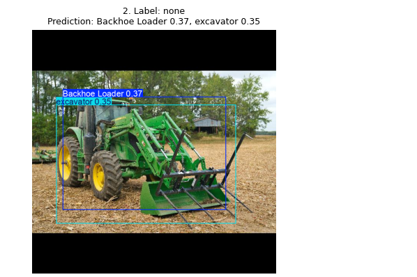
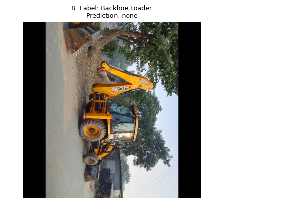
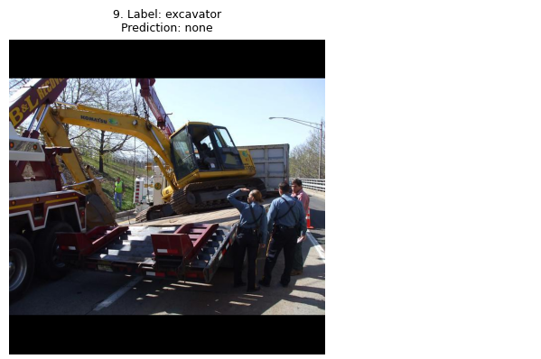
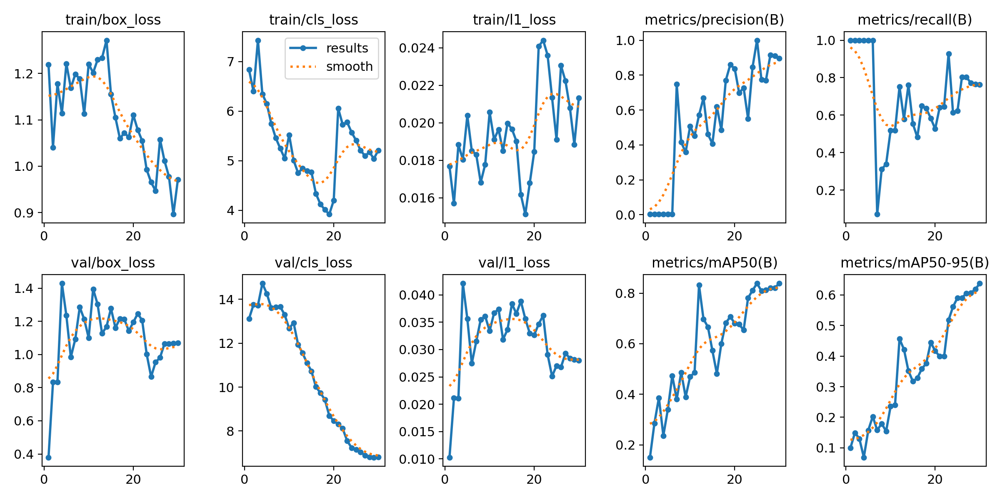

# Results and visual evidence

These figures come from the executed training notebook and frozen Roboflow version 3 export. The two trained classes are `Backhoe Loader` and `excavator`. Each thumbnail below isolates an **existing saved prediction panel**; no new model run or altered score was used to make this gallery. Select a thumbnail to see the full-size panel.

## Held-out test results

The test split contains 13 images and 12 labeled target objects.

| Precision | Recall | mAP50 | mAP50–95 |
|---:|---:|---:|---:|
| 0.812 | 0.904 | 0.938 | 0.677 |

These values describe a small test sample, not a general site-level performance guarantee.

## Three successful detections

| 1. Rear-view backhoe loader | 2. Backhoe loader at site | 3. Site excavator |
|---|---|---|
|  |  |  |
| **Backhoe Loader 0.85.** The rear view is recognized. | **Backhoe Loader 0.88.** A partly framed machine is recognized. | **excavator 0.86.** The tracked machine is recognized. |

## Failure analysis: three example photos

| Negative front-loader tractor | Sideways backhoe loader | Transported excavator |
|---|---|---|
|  |  |  |
| **Two false-positive boxes:** Backhoe Loader 0.37 and excavator 0.35 on one negative photo. | **False negative:** no box at the displayed 0.25 threshold. [Rotating this photo upright](orientation_comparison.png) led to a Backhoe Loader 0.81 prediction with the same checkpoint. | **False negative:** the excavator on a transport vehicle was missed. |

The [six-case error analysis](../docs/error_analysis.md) also isolates the extra overlapping excavator prediction and a partly visible backhoe missed in validation. It explains **three false-positive boxes across two test photos**, three false-negative examples, and three prioritized data improvements.

## Training loss and validation mAP

Training box loss fell overall and validation mAP rose across the 30-epoch run; individual curves fluctuate. The [held-out test confusion matrix](confusion_matrix.png) adds *background* for unmatched labeled objects or predictions. Background is not a third trained class.

## Complete evidence files

- [Four training annotation examples](evidence/annotation_examples_4.png): two backhoe-loader and two excavator ground-truth examples.
- [Ten fixed validation predictions](evidence/validation_predictions_10.png): eight labeled and two negative photos, selected in filename order.
- [All 13 held-out test predictions](test_predictions_grid.png): labels and predictions together, including the negative photo.
- [Five-photo inference demonstration](evidence/five_heldout_predictions.png): two backhoe loaders, two excavators, and one negative tractor. These are **held-out test photos**, unseen in training, not five independently sourced external photos.
- [Orientation comparison](orientation_comparison.png): the sideways backhoe as exported and after rotation.
- [Source credits and dataset details](../README.md#license-and-image-credit).

The three evidence sheets linked above are copies of the saved notebook figures collected in `/results/evidence/` so the requested annotation, validation, and five-photo inference examples can be opened from one folder. The individual success and failure panels in that folder are crops of the same saved prediction grids.
